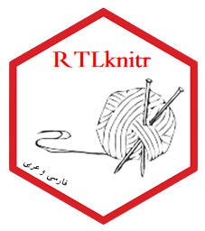

# RTLknitr

<!---ImpShrinkage  
======================

-->

The R package RTLknitr provide seamless support for right-to-left (RTL) languages, such as Persian and Arabic, in R Markdown documents and LaTeX output. It includes functions and hooks that enable easy integration of RTL language content, allowing users to create documents that adhere to RTL writing conventions.

## Installation
<!--
You can install the *stable* version from
CRAN.

s
install.packages('ImpShrinkage', dependencies = TRUE)

-->
You can install the *development* version from
Github

s
# install.packages("remotes")
remotes::install_github("FoadEsmaeili5/RTLknitr")

## To cite package `RTLknitr` in publications use:
  Esmaeili, F. (2023). _RTLknitr: Right to Left Dynamic Documents Using knitr _. R package version 1.0.0,
  <https://github.com/FoadEsmaeili5/RTLknitr>.
<!--
A BibTeX entry for LaTeX users is

  @Manual{ImpShrinkage,
    title = {ImpShrinkage: Improved Shrinkage Estimations for Multiple Linear Regression},
    author = {Mina Norouzirad and Danial Mazarei and Ricardo Moura},
    year = {2023},
    note = {R package version 1.0.0},
    url = {https://cran.r-project.org/package=ImpShrinkage}
  }
  -->
  
